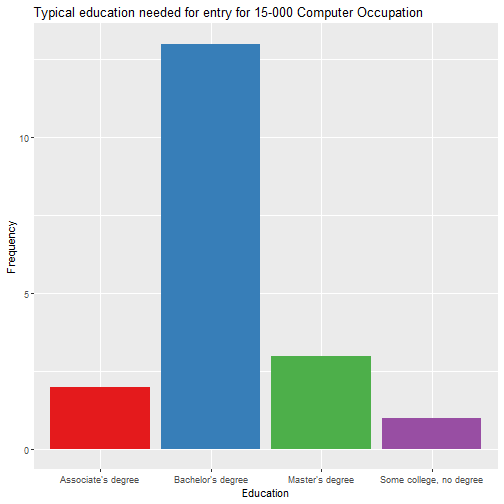

Data Skills
========================================================
author: simplymathematics
date: 10/28/2018
autosize: true

Question: Which skills are required to be a data scientist?  
========================================================
**Sources**  
- [Bureau of Labor Statistics](https://www.bls.gov/oes/current/oes150000.htm#nat)  
- [Indeed](Indeed.com) 
- [ONET](https://www.onetonline.org/)

**Datasets**
- OES Skills data, Occupational Characteristics data
- ONET Salary data, Skills data
- Indeed.com Crawl


Slide With Code
========================================================


```r
summary(cars)
```

```
     speed           dist       
 Min.   : 4.0   Min.   :  2.00  
 1st Qu.:12.0   1st Qu.: 26.00  
 Median :15.0   Median : 36.00  
 Mean   :15.4   Mean   : 42.98  
 3rd Qu.:19.0   3rd Qu.: 56.00  
 Max.   :25.0   Max.   :120.00  
```

Slide With Plot
========================================================


